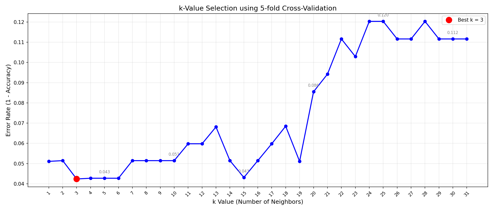
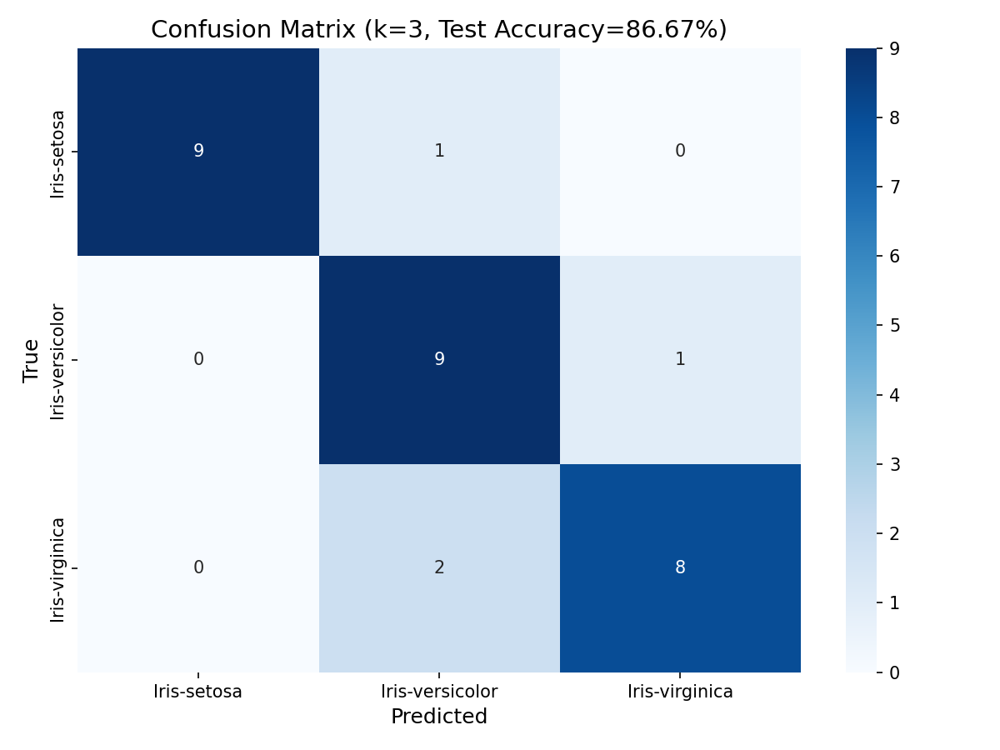

# 🌸 Iris Flower Classification using KNN

This project implements a complete machine learning pipeline to classify Iris flower species using the K-Nearest Neighbors (KNN) algorithm.

---

## 🚀 Features

- Data preprocessing and cleaning (outlier detection using IQR)
- Data normalization using Z-score scaling
- Train-test split (80/20)
- Optimal k selection using 5-fold cross-validation
- Model evaluation with multiple metrics
- Visualization (box plots, confusion matrix, k-value curve)
- Interactive prediction system (user input)

---

## 🧠 Technologies Used

- Python
- NumPy
- Pandas
- Scikit-learn
- Matplotlib
- Seaborn

---

## 📊 Model Performance

- Cross-validation used to select best k value
- High classification accuracy on test data
- Evaluation metrics:
  - Accuracy
  - Precision
  - Recall
  - F1-score

---

## 📊 Visualizations

### 📦 Feature Distribution (Box Plots)

### 📉 K Value Selection Curve

### 🔍 Confusion Matrix

---

## 📁 Project Structure

iris-knn-classifier/
│
├── data/
│   ├── data.csv
│   ├── X_train.npy
│   ├── X_test.npy
│   ├── data_cleaned.csv
│   ├── y_train.npy
│   └── y_test.npy
│
├── images/
│   ├── box_plots.png
│   ├── confusion_matrix.png
│   └── k_selection_curve.png
│
├── models/
│   └── best_k.txt
│   ├── label_encoder.pkl
│   ├── scaler.pkl
│
├── src/
│   └── iris_classifier.py
│
├── README.md
└── evaluation_results.txt
---

## ▶️ How to Run

1. Install dependencies:
2. Run the program: python src/iris_classifier.py
3. Follow the interactive input to classify flowers.

---

## 🌟 Example Output

The model predicts Iris species based on:
- Sepal length
- Sepal width
- Petal length
- Petal width

---

## 👨‍💻 Author

Ansari AI Dev  
GitHub: https://github.com/ansari-ai-dev

---

## 📌 Notes

This project was developed as part of my Software Engineering (AI) studies to demonstrate practical machine learning skills.
